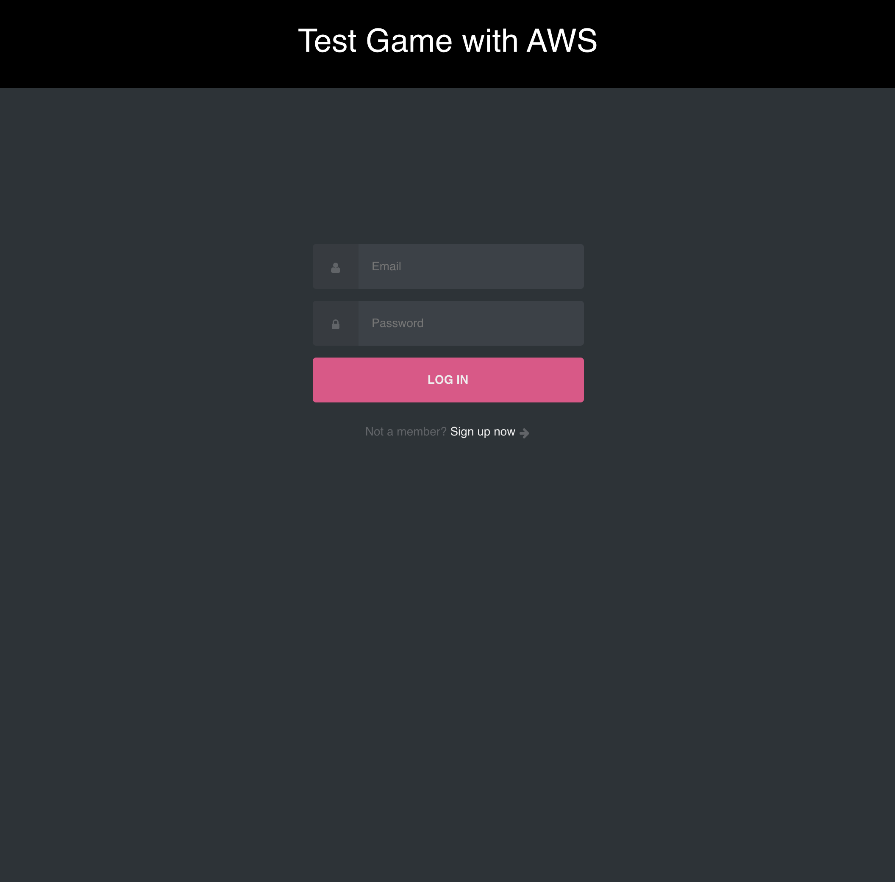
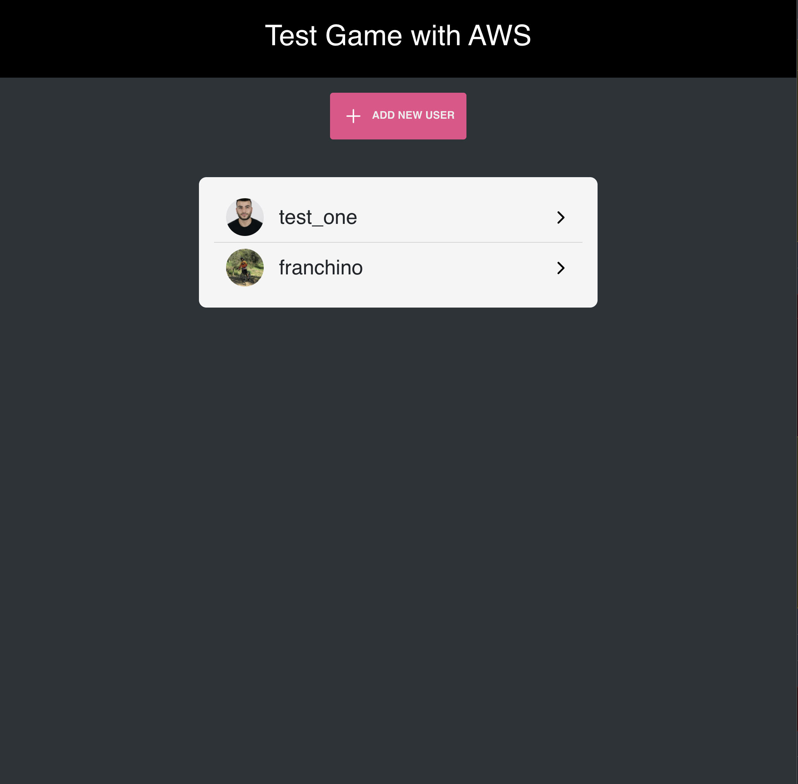
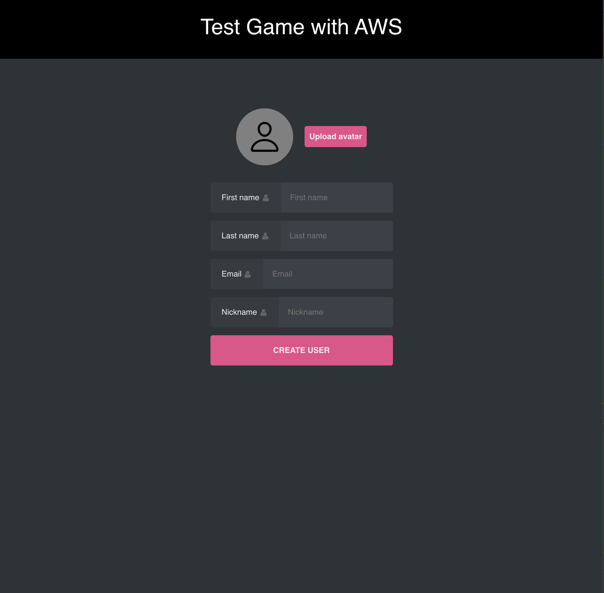
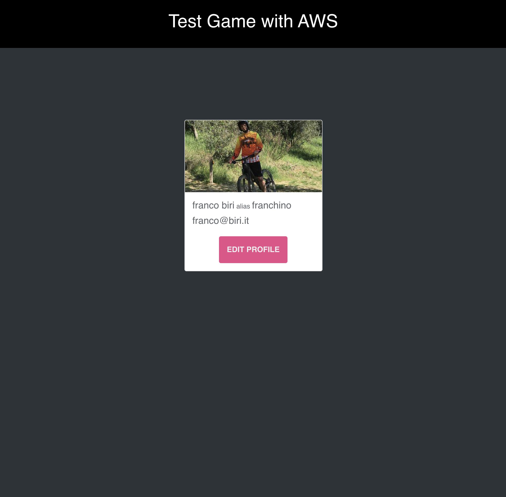
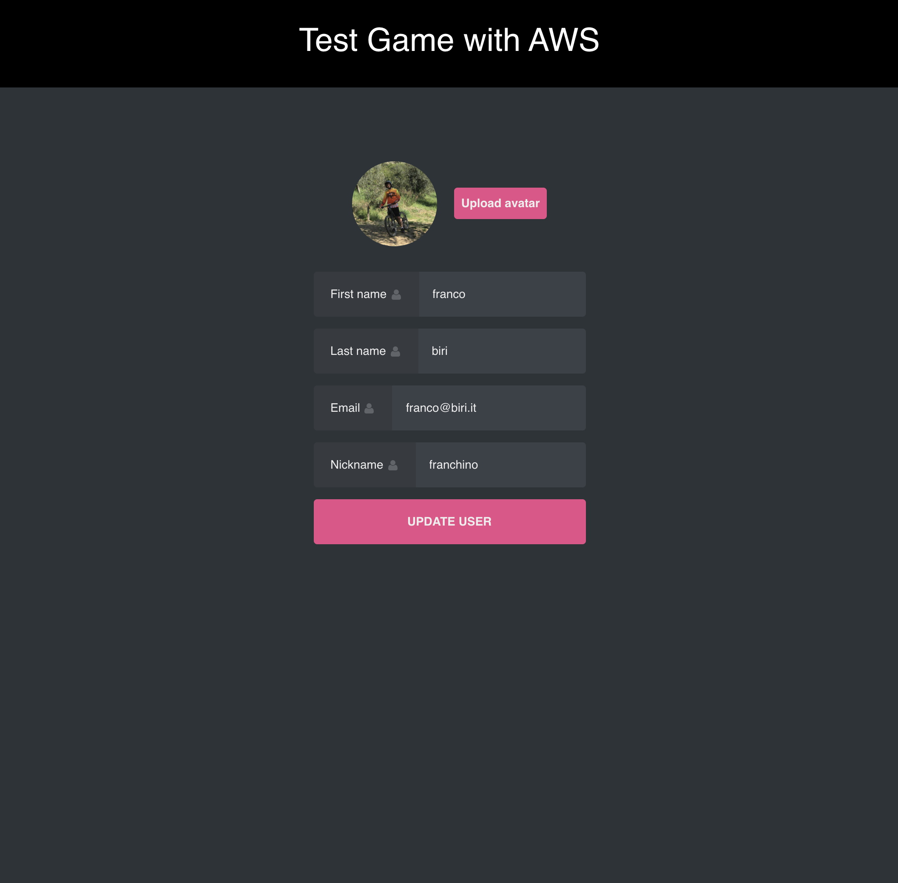

# React app with AWS Lambda, AWS API Gateway, AWS DynamoDB and AWS S3

This project shown the process to create a serverless app in React using some AWS tools, in particular:

- AWS Lambda, allowing us to create a serverless app
- AWS API Gateway, allows us to configure endpoints to be called up later in the app
- AWS DynamoDB, allowing us to save data with a NoSQL database
- AWS S3, an object storage for storing and retrieving any data

It was implemented also a login/signup page to authenticate Client using OAuth.

With this app, once logged in, you can see all the users you have created, add new ones or edit their attributes.

## React app screenshots

Login or Signup page


Populated Home page


Create new user page


User detail page


Update user page


## Available Scripts

Once the project has been downloaded, runs the command below to start app locally

```bash
npm install
npm start
```

## Create DynamoDB table

we're going to create two tables to host our data, one to store the data of the new users who register and the other one to store the data of manually created users. When we're going to create a table, we have to decide which field we want to use as partition key, with which you can make queries to retrieve the data.

There are some screenshots of the various steps in

> screenshots/aws-dynamoDB

## Create the IAM role for the Lambda function

Now we're ready to create a serverless api, but before we do that, we need to create IAM role for the lambda function to use. This is important to create before the lambda because it defines the actions that we can do with lambda function. When we're creating the role, the most important step is to choose the policies to attach for this role. We chose CloudWatchLogsFullAccess because we need to see logs from my lambda function, and we chose AmazonDynamoDBFullAccess because we need to access our data in the dynamoDB tables

Important policies to set:

- CloudWatchLogsFullAccess
- AmazonDynamoDBFullAccess

There are some screenshots of the various steps in

> screenshots/aws-iam-role

## Create Lambda function

During the creating step, we'll have to change the default role and select **_usign an existing role_** and from the dropdown list select the role created before.

The backend source code is [here!](https://github.com/LucaTrip/test-game-aws-backend).

There are some screenshots of the various steps in

> screenshots/aws-lambda

## Create API Gateway

Now, we're going to create some endpoints to query the lambda function. I've created a REST Api. To do that, before we need to create the **_Resource_**, paying attention to check **_Enable Api Gateway CORS_** because if we don't when the frontend will call it, it's going to error. For the resource just created, let's create the method that will hook into the lambda function created earlier. Go on for all other endpoints and at the end we can deploy it. The last step is to create an **_Api Key_** to grant the use of this apis only for authenticated users.

There are some screenshots of the various steps in

> screenshots/aws-api

## Create a S3 bucket

The last step is to upload and get the user profile from the AWS S3. I created a public bucket for simplicity. Then we have to define the policy of the bucket, for my project I use as action **_S3:GetObject_** and Id defined also the CORS policy open to world. To use it, I've created an IAM Policie and IAM User. Policies said what type of actions an user can do, for example this user is allowed to put image to S3 bucket.

At the end of user creation process, AWS gives us an ACCESS KEY ID and SECRET ACCESS KEY. These keys must be set correctly in the backend configuration

There are some screenshots of the various steps in

> screenshots/aws-s3
